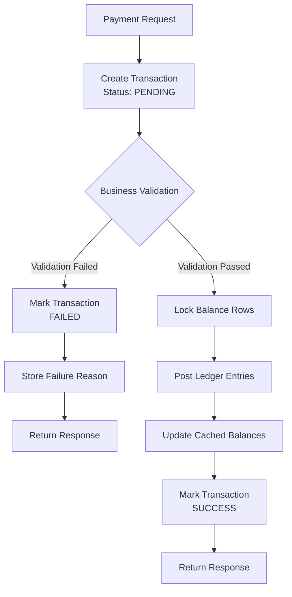

```mermaid
flowchart TD
    A[Payment Request] --> B[Create Transaction<br/>Status: PENDING]
    B --> C{Business Validation}

    C -->|Validation Failed| D[Mark Transaction<br/>FAILED]
    D --> E[Store Failure Reason]
    E --> F[Return Response]

    C -->|Validation Passed| G[Lock Balance Rows]
    G --> H[Post Ledger Entries]
    H --> I[Update Cached Balances]
    I --> J[Mark Transaction<br/>SUCCESS]
    J --> K[Return Response]
```
